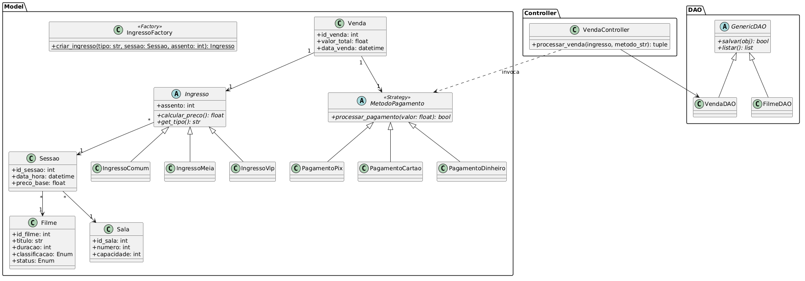

# Projeto Final das Disciplinas de APS e LPOO

Este projeto implementa um sistema de bilhetagem de cinema desenvolvido em Python, com interface gráfica (GUI) e persistência em banco de dados. O sistema foi reestruturado a partir do repositório de Tecnologia de Orientação a Objetos  para aplicar a arquitetura MVC (Model-View-Controller) e o padrão DAO (Data Access Object). O sistema gerencia e associa o catálogo (filmes, salas e sessões), ingressos, pagamentos e o histórico de vendas.

## Documentação e Diagramas UML



Toda a documentação de Análise e Projeto de Sistemas (APS), contendo o escopo, requisitos funcionais e não funcionais, regras de negócio e os diagramas de Casos de Uso e Classes, encontra-se detalhada no arquivo secundário deste repositório.
[Documentação do Projeto (APS)](./uml/Documentação%20do%20Projeto.md)

## Principais Componentes e Arquitetura
O sistema foi modularizado separando as responsabilidades:

### Model (Regras de Negócio)
- **Filme, Sala e Sessao** formam o núcleo.
- **Ingresso** atua como base abstrata para **IngressoComum**, **IngressoMeia** e **IngressoVip**.
- O módulo de pagamento utiliza o padrão Strategy, contendo as classes concretas **PagamentoDinheiro**, **PagamentoPix** e **PagamentoCartao**.
- **Venda** integra ingresso e pagamento, consolidando a transação.

### DAO (Persistência)
- **GenericDAO** é a classe abstrata que define as operações base do CRUD (salvar, listar, remover, atualizar, buscar).
- Implementações específicas incluem **FilmeDAO**, **SalaDAO**, **SessaoDAO**, **IngressoDAO** e **VendaDAO**, que comunicam diretamente com o PostgreSQL através do `db_config.py`.

### Controller (Fluxo de Dados)
- Atuam como intermediários entre a View e o DAO. Eles recebem os dados brutos da interface, realizam validações, convertem tipos, aplicam regras de negócio e instanciam as classes do Model antes de enviá-las ao banco de dados.

### View (Interface Gráfica)
- Telas desenvolvidas em **Tkinter**.
- Divididas em Área Administrativa (CRUD de catálogos e consulta de histórico de vendas) e Área do Cliente (Jornada interativa de compra de ingresso).

## Padrões de Design Adicionais

### Padrão Factory
O padrão Factory é utilizado no `IngressoController` para instanciar diferentes tipos de ingressos (comum, meia, VIP) a partir da string selecionada pelo cliente na View.

### Padrão Strategy
O padrão Strategy é utilizado no `VendaController` para definir diferentes métodos de pagamento, recebendo a string da View e instanciando o método correto para realizar a transação antes de salvá-la no banco de dados.

# Estrutura das Pastas e Pilares de POO
O sistema foi desenvolvido aplicando os pilares da POO (Abstração, Encapsulamento, Herança e Polimorfismo), e também uma estrutura de diretórios:

* **/model:** Encapsulamento de atributos via properties e métodos de classe com herança (Ingresso e Pagamento) e polimorfismo (`calcular_preco()` e `processar_pagamento()`).
* **/dao:** Abstração e Herança na implementação da comunicação SQL isolada por entidade.
* **/controller:** Encapsulamento da orquestração do sistema.
* **/view:** Abstração gráfica através de heranças nativas do Tkinter (`tk.Toplevel`).

# Instruções de Execução

Para executar o projeto localmente, siga os passos:

### 1. Requisitos de Ambiente
- Python 3.10 ou superior.
- SGBD PostgreSQL rodando localmente.
- Instalar a biblioteca do banco de dados via terminal:
  ```bash
  pip install psycopg2-binary

### 2. Configurar o Banco de Dados
- Crie um banco de dados chamado `lpoo_projeto_gabriel_tanabe` no seu PostgreSQL.
- Execute o script de criação de tabelas disponível em `sql/query.sql`.
- Abra o arquivo `dao/db_config.py` e configure a senha correspondente ao seu ambiente local.

### 3. Executar o Sistema
O arquivo `main.py` demonstra o funcionamento completo do sistema através de uma interface gráfica.

Para executar, rode no terminal:
`python main.py`

Ao rodar o comando, a janela principal será aberta, permitindo:
- Acessar o menu de Administração para cadastrar filmes, salas e as sessões disponíveis.
- Acessar o menu do Cliente para simular o fluxo completo de compra: seleção da sessão e assento, geração do ingresso (via Factory), e finalização da venda com o processamento do pagamento (via Strategy).

---
### Declaração de Uso de IA

Declaro que utilizei a Inteligência Artificial Gemini (Google) como ferramenta de apoio durante o desenvolvimento deste projeto de APS/LPOO. A IA foi utilizada de forma auxiliar para:
- Refatorar o código base de POO e isolar as responsabilidades nas camadas MVC.
- Gerar códigos para a renderização e estilização das tabelas *Treeview* do Tkinter.
- Estruturar a sintaxe dos diagramas PlantUML exigidos em APS.
- **Onde foi aplicada:** A IA atuou como suporte prático na refatoração do código de POO original para a arquitetura em camadas (MVC e padrão DAO). A sua utilização focou-se na geração para a interface gráfica Tkinter — especialmente nas listagens `Treeview` —, no auxílio da estruturação das queries SQL para o PostgreSQL.
- **Principais aprendizados:** A interação com a ferramenta ajudou a consolidar o entendimento sobre baixo acoplamento de software. Como utilizar a camada *Controller* para isolar a interface visual das regras de negócio e do banco de dados. Além disso, compreendi a aplicação real e eficiente de *Design Patterns* avançados, utilizando o *Factory Method* para a criação dinâmica de ingressos e o *Strategy* para o processamento de diferentes métodos de pagamento.